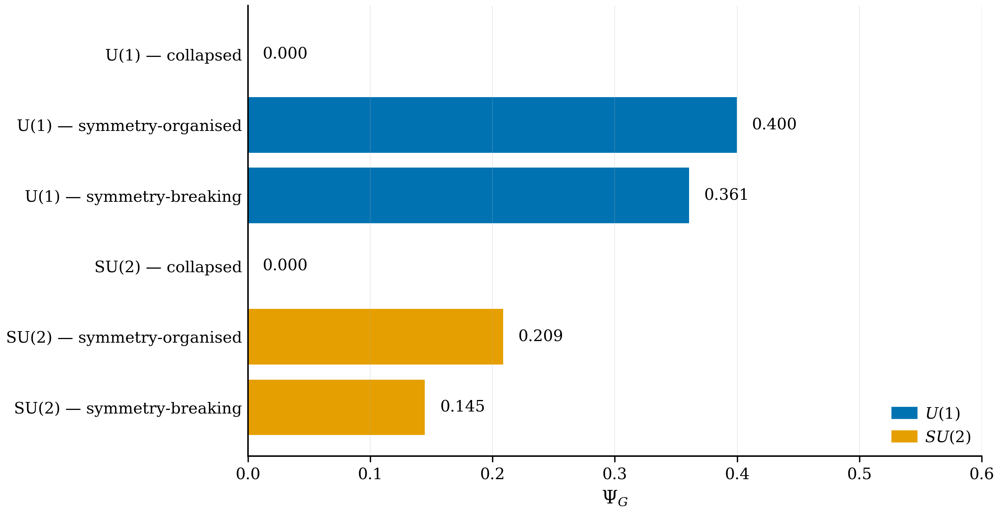

# Symmetry-Organised Complexity in Quantum Neural Networks

This repository accompanies the paper, Ugail, H., & Howard, N. (2026). Symmetry-Organised Complexity in Quantum Neural Networks. Symmetry, 18(6), 912. https://doi.org/10.3390/sym18060912


Quantum neural networks (QNNs) are often evaluated by raw Hilbert-space expressivity, but a model that explores a large state space without respect for the symmetry of the learning problem can be both hard to train and slow to generalise. **Symmetry-organised complexity** is a representation-theoretic trajectory diagnostic that measures how a QNN distributes its expressive capacity across the multiplicity structure of a target symmetry, rather than how much of Hilbert space it visits. The diagnostic combines sector occupation, cross-irreducible-representation organisation, and symmetry metastability into a single composite index, multiplied by an ansatz-level compliance factor that penalises symmetry violation.



## What does this measure?

The composite index Ψ_G is built from four components:

1. A normalised Shannon entropy of the time-averaged sector distribution.
2. A cross-irreducible-representation contribution that combines inter-sector coherence with a within-multiplicity diversity term, conditionally normalised over the active multiplicity mass.
3. A symmetry metastability term that records how the sector composition varies along the trajectory.
4. An ansatz-level compliance factor that penalises trajectories whose effective trainable generator fails to commute with the target group generators.

Two analytically tractable four-qubit examples and one trained classification task exercise the diagnostic. The headline numerical findings are:

- **The composite index separates sector-collapsed, symmetry-organised, and symmetry-breaking trajectories.** For the U(1) excitation-number example the values are 0.000, 0.400, and 0.361 respectively. For the SU(2) total-spin example they are 0.000, 0.209, and 0.145. The organised-to-breaking gap is mediated by the compliance penalty for U(1) and reinforced by smaller raw components for SU(2).
- **On a trained U(1)-compatible teacher-student classification task, the diagnostic ranks three matched-parameter ans\u00E4tze in the same order as their generalisation accuracy.** Test accuracy is 0.880 \u00B1 0.051 for the equivariant student, 0.755 \u00B1 0.033 for the hybrid student, and 0.425 \u00B1 0.040 for the non-equivariant student. The composite index ranks them 0.527, 0.485, and 0.425.
- **For an exactly equivariant ansatz the diagnostic is parameter-independent on a fixed input ensemble**, identifying the family rather than any particular trained set of parameters. All five random seeds produce identical Ψ_G for the equivariant ansatz in the trained task, while the hybrid and non-equivariant ans\u00E4tze produce non-zero seed dispersion.
- **The qualitative ordering is robust across a wide range of weight and compliance-sharpness choices.** On a simplex grid of 231 weight points and eight values of the compliance sharpness, the SU(2) example and the trained U(1) task are essentially insensitive to the weight choice at all sharpness values at or above one. The U(1) toy example is the most sensitive case but reaches full robustness at sharpness five and above.

## Contents

- **`Symmetry_Organised_Complexity_QNN.ipynb`** \u2014 the full analysis pipeline. It implements every component of the composite index, generates the three U(1) and three SU(2) trajectories of the numerical examples, trains the three matched-parameter ans\u00E4tze of the trained-task experiment with five random seeds each, runs the weight-and-sharpness sensitivity sweep over a simplex grid of 231 weight points, and produces all eight figures and four result tables reported in the manuscript.

- **`verify_results.py`** \u2014 a quick verification script for reviewers. Loads the precomputed result tables in `Results/` and confirms that every headline number reported in the manuscript is reproducible from those tables. Takes a few seconds, needs no GPU and no quantum software development kit, and prints a clean PASS/FAIL summary.

- **`Results/`** \u2014 the precomputed result tables and figures produced by the notebook, sufficient to reproduce every figure and table in the manuscript without re-running the pipeline. The directory contains the toy-examples summary table, the trained-task per-seed and aggregated tables, the weight-and-sharpness sensitivity table, the eight publication figures, and a JSON run manifest recording the package versions and the full configuration used.

- **`requirements.txt`** \u2014 full dependencies for re-running the notebook (numpy, scipy, pandas, matplotlib, jupyter). No GPU, no PyTorch, and no quantum software development kit is needed. The pipeline runs end-to-end in a few minutes on a standard laptop.

- **`requirements-verify.txt`** \u2014 minimal dependencies for `verify_results.py` only (pandas, numpy).

## Quick start

The fastest way to check the headline numbers is:

```
git clone https://github.com/ugail/Symmetry-Organised-Complexity-QNN.git
cd Symmetry-Organised-Complexity-QNN
pip install -r requirements-verify.txt
python verify_results.py
```

The script prints one line per check and a summary at the end. All checks should pass against the precomputed tables in `Results/`.

## Reproducing the full pipeline

Re-running the full pipeline does not require a GPU. Install the full dependencies and open the notebook:

```
pip install -r requirements.txt
jupyter notebook Symmetry_Organised_Complexity_QNN.ipynb
```

The notebook autodetects whether it is being run in Google Colab or locally. In Colab, results are written to a configured Google Drive folder; locally, they are written to `./Results/` in the working directory. Execute the cells in order. A full run produces every figure and table in the manuscript and takes a few minutes on a standard laptop.

The configuration cell at the top of the notebook records every hyperparameter used in the manuscript: the weight choice (w_H, w_D, w_M) = (0.40, 0.35, 0.25), the compliance sharpness \u03B3 = 3, the trajectory length T = 80, the four-qubit register size, the trained-task settings of 65 epochs, learning rate 0.045, simultaneous-perturbation perturbation magnitude 0.055, and five random seeds per ansatz, and the sensitivity sweep over a simplex grid of spacing 0.05 and eight compliance-sharpness values.

## Who is this for?

- **Researchers in quantum machine learning** who want a single transparent score that summarises symmetry-compatible organisation along a trajectory, complementary to expressibility, effective dimension, and quantum neural tangent kernel analyses.
- **Researchers in equivariant and geometric quantum machine learning** who want a worked example of how representation-theoretic structure (Schur block decomposition, commutant dimension counting, multiplicity-space diversity) can be combined with trajectory-level statistics to characterise an ansatz family.
- **Methods builders** who want a reusable template for a representation-theoretic diagnostic with explicit normalisation conventions, boundedness proofs, a multiplicity-purity condition for sector-collapse vanishing, an ansatz-level compliance factor, and a sensitivity analysis over the diagnostic\u2019s free parameters.

## Citation

If you use the symmetry-organised complexity index, the code in this repository, or the precomputed result tables, please cite:

> Ugail, H., & Howard, N. (2026). Symmetry-Organised Complexity in Quantum Neural Networks. Symmetry, 18(6), 912. https://doi.org/10.3390/sym18060912

## License

The code in this repository is released under the MIT License. See `LICENSE` for the full text.
